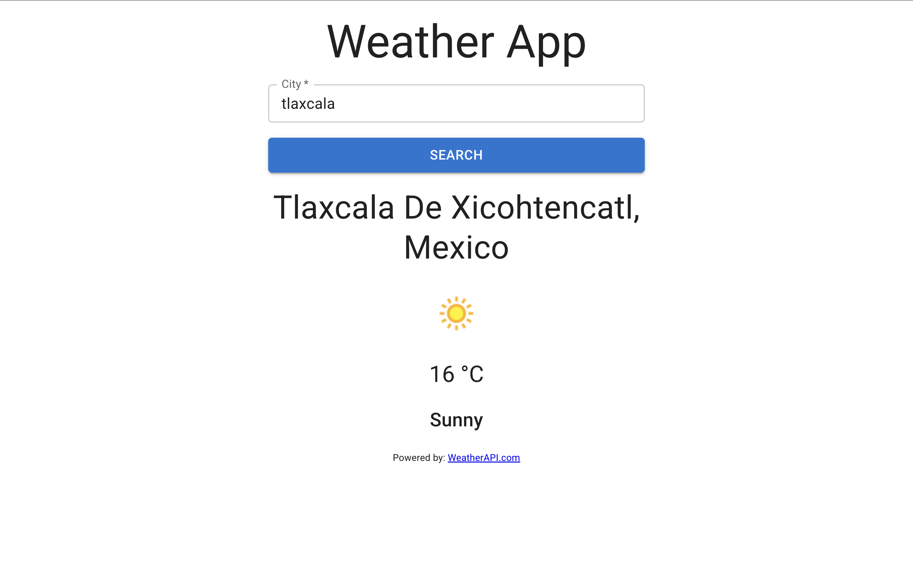

# 🌤️ Weather UI App

A polished, Material Design weather application built with **React 19** and **MUI (Material UI) v7**. Features a clean UI with loading states, form validation, error handling, and toast notifications — powered by the **WeatherAPI.com** service.

### 🔗 [Live Demo](https://weather-ui-app.vercel.app/)

---

### Tech Stack


---

### Features

- 🌡️ **Current Weather Data** — Temperature in Celsius, weather condition, and icon
- 🏙️ **City + Country Display** — Shows full location details
- ⏳ **Loading States** — MUI `LoadingButton` with spinner feedback
- ✅ **Form Validation** — Required field validation with error messages
- 🔔 **Toast Notifications** — Powered by Notistack for snackbar alerts
- 🎨 **Material Design** — Consistent, professional UI with MUI components
- 📐 **Roboto Typography** — Proper font loading via `@fontsource/roboto`
- 📱 **Responsive Layout** — Centered container with max-width constraint

---

### Project Structure

```
weather-ui-app/
├── index.html
├── package.json
├── vite.config.js
└── src/
    ├── main.jsx          # Entry point with CssBaseline, SnackbarProvider
    ├── App.jsx            # Main weather app component
    ├── index.css          # Global styles
    └── assets/
        └── react.svg      # Default Vite asset
```

---

### Getting Started

#### Prerequisites
- Node.js ≥ 18
- A free [WeatherAPI.com key](https://www.weatherapi.com/signup.aspx)

#### Installation

```bash
# Clone the repository
git clone https://github.com/JohnCard/weather-ui-app.git

# Navigate to the project
cd weather-ui-app

# Install dependencies
npm install

# Create environment file
echo "VITE_APP_WEATHER=your_weatherapi_key_here" > .env

# Start development server
npm run dev
```

#### Environment Variables

| Variable | Description |
|---|---|
| `VITE_APP_WEATHER` | Your WeatherAPI.com API key |

---

### Screenshots

| Search interface |
|:-:|
|  |